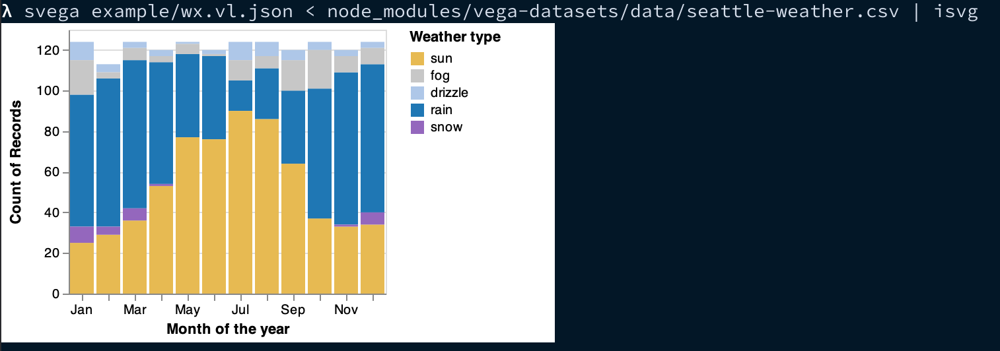

# svega

A cli tool to render [vega-lite](https://vega.github.io/vega-lite) visualizations to svg.



## Installation

```
npm install --global @junosuarez/svega

# or

yarn add --global @junosuarez/svega
```

## Usage

```
svega [opts] <spec.vl.json> < data.json > out.svg

   stdin must be data, stdout will be svg or empty

   OPTIONS:
     --format=[auto],json,ndjson,csv
```

The output on stdout is an SVG string. You can save this to a file, open it in your favorite viewer, or display it right in your terminal:

## Displaying svg in your terminal

Kudos to [Kate](https://twitter.com/thingskatedid/status/1316074032379248640) for sending me down this whole graphical terminal adventure.

The examples use `isvg`, the following shell alias, using [kitty terminal](https://sw.kovidgoyal.net/kitty/kittens/icat.html) and rsvg-convert (with `brew install imagemagick`):

```sh
alias isvg='rsvg-convert --zoom=2 | kitty icat --align=left'
```

## Alternatives

There is an official [vega-cli](https://github.com/vega/vega/tree/master/packages/vega-cli) package that includes two tools that may suit your needs:

- vg2svg
- vl2svg
